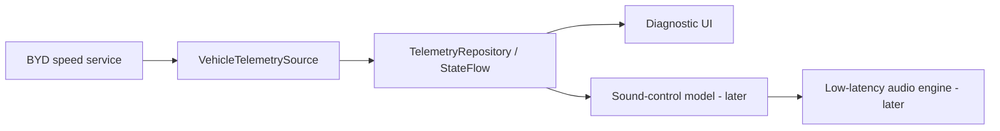
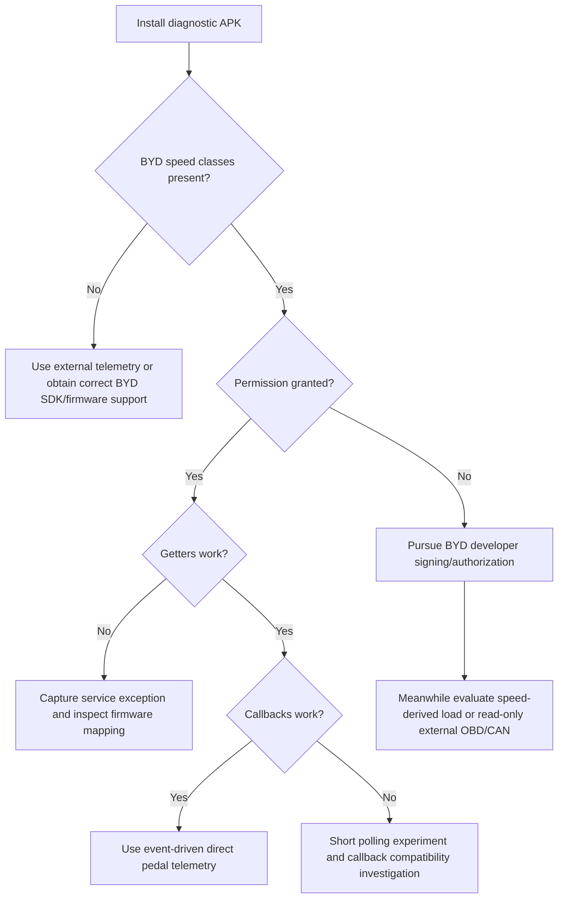

# Telemetry POC Implementation and On-Car Test Plan

Last updated: 2026-08-15

> Implementation status: the reflection/getter and 20 ms polling portion is implemented in the `mobile` module and builds successfully. See [poc-implementation.md](poc-implementation.md). Listener callbacks and the optional shell helper remain later steps pending the first on-car result.

## POC objective

Build the smallest application that can prove or disprove access to BYD accelerator depth, brake depth, and speed on the target Seal firmware, while measuring callback cadence and application/UI delay.

The POC is read-only. It must not control vehicle functions, write CAN data, or attempt to bypass platform signature enforcement.

## Required output on screen

Primary telemetry:

- accelerator depth, integer percent;
- brake depth, integer percent;
- vehicle speed, decimal km/h;
- visual bars for accelerator and brake.

Diagnostics:

- Android release/API level;
- device/build/model strings;
- standard automotive feature present/absent;
- BYD speed class present/absent;
- `BYDAUTO_SPEED_GET` present/absent;
- permission protection level;
- permission granted/denied;
- `getInstance` success/failure;
- most recent getter/callback result;
- event source: callback, poll, or unavailable;
- callback count and callbacks per second;
- last callback interval, rolling mean, p95, and maximum;
- age of last accelerator/brake/speed value;
- latest exception class/message, without sensitive data.

## Recommended project change

The existing `automotive` module is an Android Automotive media-template shell. For the first POC:

1. Add a regular launcher Activity to `automotive`.
2. Remove or set `required="false"` for `android.hardware.type.automotive` until the real head unit reports the feature.
3. Temporarily remove dependence on the empty media-service workflow from the telemetry entry point. The shared service can remain in the project but should not be required to display telemetry.
4. Add only `android.permission.BYDAUTO_SPEED_GET` as the new BYD permission.
5. Keep the UI simple. AppCompat Views or Compose are both acceptable; telemetry correctness and timing matter more than styling.
6. Keep `minSdk 28`. Compile API 37 is acceptable, but all runtime behavior must be compatible with the likely Android 10/API 29 head unit.

Suggested later structure:



## SDK integration strategy

### Preferred: official SDK as compile-only

Obtain the current BYD SDK from the Open Platform if possible. Add its API JAR as `compileOnly`, because the actual implementations live on the vehicle. Do not package the SDK classes in the APK.

Conceptual Gradle configuration:

```kotlin
dependencies {
    compileOnly(files("libs/byd-auto-api.jar"))
}
```

### POC alternative: minimal compile-only stubs

If the official SDK cannot be downloaded, create a minimal compile-only stub JAR containing only the public signatures documented by BYD:

```java
package android.hardware.bydauto.speed;

public class BYDAutoSpeedDevice {
    public static BYDAutoSpeedDevice getInstance(android.content.Context context);
    public int getAccelerateDeepness();
    public int getBrakeDeepness();
    public double getCurrentSpeed();
    public void registerListener(AbsBYDAutoSpeedListener listener);
    public void unregisterListener(AbsBYDAutoSpeedListener listener);
}
```

```java
package android.hardware.bydauto.speed;

public abstract class AbsBYDAutoSpeedListener {
    public void onAccelerateDeepnessChanged(int value) {}
    public void onBrakeDeepnessChanged(int value) {}
    public void onSpeedChanged(double value) {}
    public void onError(int errorCode, String message) {}
}
```

The exact constructor/interface hierarchy must match the runtime SDK. The community-decompiled stubs include `IBYDAutoListener` and other parent types, so a minimal hand-written stub may need those signatures to satisfy runtime class verification. Prefer the official JAR or a carefully isolated compile-only stub set.

Never include stub implementations in the final APK. Stub methods that throw are normal for compile-only artifacts; they must never execute on the development computer or be packaged in the APK.

### Reflection-only preflight

Reflection can prove that the class exists and invoke the three getters without compiling against BYD classes:

```kotlin
val type = Class.forName("android.hardware.bydauto.speed.BYDAutoSpeedDevice")
val instance = type.getMethod("getInstance", Context::class.java).invoke(null, context)
val throttle = type.getMethod("getAccelerateDeepness").invoke(instance) as Int
val brake = type.getMethod("getBrakeDeepness").invoke(instance) as Int
val speed = type.getMethod("getCurrentSpeed").invoke(instance) as Double
```

Reflection alone cannot conveniently implement `AbsBYDAutoSpeedListener` because it is an abstract class, not an interface suitable for `Proxy`. Use reflection only as an early capability/getter test, not the final low-latency design.

## Manifest

Minimum requested permission:

```xml
<uses-permission android:name="android.permission.BYDAUTO_SPEED_GET" />
```

Do not add AC, bodywork, gearbox, sensor, install-package, or control permissions unless a concrete later feature needs them.

## Startup capability probe

Run in this order and keep each result visible:

1. Capture `Build.VERSION.RELEASE`, `SDK_INT`, `Build.MODEL`, `Build.DEVICE`, and `Build.DISPLAY`.
2. Query `PackageManager.hasSystemFeature("android.hardware.type.automotive")`.
3. Use `PackageManager.getPermissionInfo` for `BYDAUTO_SPEED_GET`.
4. Record the base protection level and flags.
5. Call `ContextCompat.checkSelfPermission`/`checkSelfPermission`.
6. Use `Class.forName` for both speed classes.
7. Instantiate `BYDAutoSpeedDevice` inside a narrow exception boundary.
8. Read all three initial values.
9. Register the listener.
10. Start a short watchdog: if no callbacks arrive while getters change, report “getters work / callbacks unproven” rather than “API failed.”

Possible states should be modeled explicitly:

```text
UnsupportedClass
PermissionUndefined
PermissionDenied(protectionLevel)
ServiceUnavailable(exception)
GetterOnly
ListenerActive
Error(exception)
```

Do not collapse every failure into a zero value. Zero is a valid accelerator/brake value.

## Listener implementation shape

Conceptual Kotlin:

```kotlin
private val listener = object : AbsBYDAutoSpeedListener() {
    override fun onAccelerateDeepnessChanged(value: Int) {
        telemetry.onThrottle(value, SystemClock.elapsedRealtimeNanos())
    }

    override fun onBrakeDeepnessChanged(value: Int) {
        telemetry.onBrake(value, SystemClock.elapsedRealtimeNanos())
    }

    override fun onSpeedChanged(value: Double) {
        telemetry.onSpeed(value, SystemClock.elapsedRealtimeNanos())
    }

    override fun onError(errorCode: Int, message: String?) {
        telemetry.onBydError(errorCode, message)
    }
}
```

Lifecycle:

```kotlin
override fun onStart() {
    super.onStart()
    speedDevice = BYDAutoSpeedDevice.getInstance(this)
    publishInitialGetters(speedDevice)
    speedDevice.registerListener(listener)
}

override fun onStop() {
    runCatching { speedDevice?.unregisterListener(listener) }
    super.onStop()
}
```

The actual callback thread is undocumented. Timestamp and copy the value immediately, then publish thread-safely to `StateFlow` or post to the main thread. Do not perform file I/O, audio decoding, or expensive statistics in the callback.

## Data model

Keep source values and presentation values separate:

```kotlin
data class PedalSample(
    val value: Int,
    val receivedAtNanos: Long,
    val sequence: Long,
    val source: Source
)

data class SpeedSample(
    val kmh: Double,
    val receivedAtNanos: Long,
    val sequence: Long,
    val source: Source
)
```

Validate/document out-of-range values but retain the raw value in diagnostic logs. Clamp only for drawing progress bars.

## Latency and cadence measurements

At callback entry:

- capture `SystemClock.elapsedRealtimeNanos()`;
- increment a per-signal sequence;
- calculate interval from the preceding event of that signal;
- update an in-memory fixed-size interval ring buffer;
- publish the sample.

Track:

- event count;
- events/second over a rolling window;
- last, mean, p50, p95, and maximum interval;
- stale age (`now - receivedAt`);
- UI frame/display time if possible.

There is no source timestamp in the documented callback, so true pedal-to-callback latency cannot be computed directly. A high-frame-rate video showing the physical action and UI can give an approximate end-to-end result. Callback interval and callback-to-render delay can be measured precisely in-app.

Do not smooth values in the first test. Smoothing is a later sound-design choice and would hide transport behavior.

## Polling fallback for the POC

If getters work but callbacks do not, enable an explicit diagnostic polling mode:

- start at 20 ms (50 Hz) only for a short controlled test;
- measure each getter-call duration;
- skip overlapping polls;
- back off to 50-100 ms if calls block, throw, or consume noticeable CPU;
- label all samples as `POLL`;
- stop polling when the Activity stops.

Polling is not the preferred production path. It can create Binder pressure and cannot make an upstream signal update faster than the vehicle service.

## Build-time and runtime checks

Before installing:

- confirm no `android/hardware/bydauto` classes are packaged in the APK;
- inspect the final manifest for only intended permissions;
- confirm a launcher Activity exists;
- confirm `android.hardware.type.automotive` is not required;
- ensure release optimization does not strip the listener subclass; add a narrow keep rule if needed;
- retain exception stack traces locally but remove identifiers.

After installing:

- inspect the installed package permission state;
- capture logcat around startup;
- verify the Activity can restart without duplicate listeners;
- verify stopping/restarting does not leak the BYD device or callback.

## Useful ADB diagnostics from PowerShell

```powershell
adb devices
adb shell getprop ro.build.version.release
adb shell getprop ro.build.version.sdk
adb shell getprop ro.build.display.id
adb shell getprop ro.product.model
adb shell pm list features
adb shell dumpsys package android | Select-String -Pattern "BYDAUTO_SPEED_GET" -Context 2,5
adb shell dumpsys package com.gabrielpc.bydmotorsound | Select-String -Pattern "BYDAUTO_SPEED_GET" -Context 2,5
adb shell service list | Select-String -Pattern "byd|auto|car"
adb logcat -c
adb logcat | Select-String -Pattern "BYDMotorSound|BYDAuto|DiCar|SecurityException"
```

Some production head units may not expose ADB. If unavailable, make the same diagnostics visible/copyable inside the application.

## Parked on-car validation checklist

Safety conditions:

- vehicle stationary;
- transmission in Park;
- parking brake applied;
- no driver interaction with the screen while moving;
- ideally one person operates pedals and a second observes/records diagnostics.

Test sequence:

1. Start with the vehicle powered sufficiently for the head unit and capture baseline values.
2. Restart the app once to check listener cleanup.
3. With the vehicle still in Park, press/release the brake slowly several times and observe depth/cadence.
4. If safe and the vehicle permits sensor reporting in Park, make very small accelerator movements. Stop if the vehicle changes state unexpectedly.
5. Compare gradual versus quick pedal movements.
6. Hold each pedal steady and confirm whether callbacks stop while values remain constant.
7. Switch between the app foreground/background only when safe and observe event continuity.
8. Export a redacted diagnostic summary; do not export VIN/IMEI/ICCID/location.

If accelerator input cannot be safely exercised in Park, validate it only in a controlled private area with a passenger operating the app/logger. Do not test by interacting with the screen in public traffic.

## POC success criteria

Minimum technical success:

- app installs and launches on firmware `13.1.33.2503250.1`;
- permission/class/service status is unambiguous;
- speed shows a plausible value;
- brake and accelerator values either respond or produce a clearly diagnosed access/availability result;
- no crashes on repeated start/stop;
- callback/poll timing is recorded.

Direct-path success:

- `BYDAUTO_SPEED_GET` granted;
- getters return values in documented ranges;
- listener callbacks arrive for pedal changes;
- callback values agree with getter values;
- UI reflects a callback within the next display frame under normal load.

Permission-blocked result is still a successful diagnostic POC if it records:

- permission definition and signature protection;
- denied grant state;
- class presence;
- thrown exception/service behavior;
- APK signing certificate used for the test.

## Decision tree after the first vehicle test



## Later audio phase - intentionally not part of this POC

Once telemetry is proven, add a separate sound-control layer:

- use speed for base virtual RPM/pitch;
- use direct accelerator depth for load/attack if available;
- use brake depth and negative acceleration for unload/deceleration/regen character;
- apply dead bands, rate limits, and attack/release filters;
- keep raw telemetry available for diagnostics;
- implement audio focus, foreground playback, and predictable interaction with other media;
- test latency with predecoded loop assets and a low-latency audio path.

Do not couple BYD callbacks directly to audio file operations. Vehicle telemetry, control modeling, and audio rendering should remain separate components.
